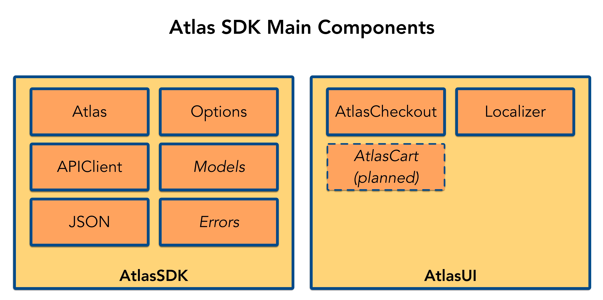

[](https://github.com/Carthage/Carthage)
[]()
[]()
[]()
[](https://raw.github.bus.zalan.do/Atlas/atlas-ios/master/LICENSE)

[](https://codebeat.co/projects/github-com-zalando-incubator-atlas-ios)
[](https://codecov.io/gh/zalando-incubator/atlas-ios)
[](https://dashboard.buddybuild.com/apps/57a305cb34a9450100595b71/build/latest)
[](https://travis-ci.org/zalando-incubator/atlas-ios)

# Atlas iOS SDK
Atlas iOS SDK for Zalando Checkout and Catalog APIs.

The purpose of this project is to provide seamless experience of Zalando articles checkout integration to the 3rd party iOS apps.

Our goal is to allow iOS developer integrate and run Zalando checkout in minutes
using a few lines of code.
There is an __AtlasCheckout__ framework in place to have end-to-end solution including UI part for the checkout flow.

If you want to have a full control over the UI and manage checkout flow by yourself
there is a low level __AtlasSDK__ framework that covers all Checkout API calls and provide you
high-level business objects to deal with.


## Atlas SDK Structure

1. Provides main entry point for basic functions for Atlas SDK
1. Keeps entities used in all sub-projects.
1. Doesn't contain UI related calls



### Commons

Contains all the generic methods used internally within Atlas SDK. Think about it as Cocoa Touch Foundation.

### Commons UI

Contains all the generic UI methods used internally within Atlas SDK. Think about it as Cocoa Touch UIKit.

### API Client

Provides all API network calls. Shouldn't be used externally.

### Models

Contains all public models used for API calls.

### Checkout

Public Checkout functionality provided to customers.

## How to use it

1. Configure Atlas SDK first in the AppDelegate:

    ```swift
    import AtlasSDK

    @UIApplicationMain
    class AppDelegate: UIResponder, UIApplicationDelegate {
       func application(application: UIApplication, didFinishLaunchingWithOptions launchOptions: [NSObject: AnyObject]?) -> Bool {
            AtlasSDK.configure(Options(clientId: "CLIENT_ID", salesChannel: "SALES_CHANNEL_ID"))
            return true
        }
    }
    ```

2. Start checkout somewhere in your view controller, e.g. when a user tap on a buy button:

    ```swift
    import UIKit
    import AtlasCheckout

    class ViewController: UIViewController {
        @IBAction private func buyButtonTapped(sender: UIButton) {
            let sku = "sku-123"
            AtlasCheckout.presentCheckout(sku: sku)
        }
    }
    ```

3. No third step :)

## Development environment setup

### Requirements

- Carthage
- SwiftLint

```
brew install swiftlint carthage
gem install bundler
bundle install
```

### Start developing

```
git clone git@github.bus.zalan.do:Atlas/atlas-ios.git && cd $_
./calypso.rb deps build
open Atlas.xcworkspace
```

### SwiftLint

There's `./calypso.rb lint check` for check and `./calypso.rb lint fix` to apply rules tasks manually.

The same `check` task is included into the build targets.


### Changelog generation

Sometime it is very helpful to have a full changelog.
In order to generate a new one you need to set environment variable CHANGELOG_GITHUB_TOKEN pointing
to the [GitHub access token for command-line use](https://help.github.com/articles/creating-an-access-token-for-command-line-use/)

After that simply run `./calypso.rb docs changelog` to generate new CHANGELOG.md file.

## LICENSE

The MIT License (MIT) Copyright © 2016 Zalando SE, https://tech.zalando.com

Permission is hereby granted, free of charge, to any person obtaining a copy of this software and associated documentation files (the “Software”), to deal in the Software without restriction, including without limitation the rights to use, copy, modify, merge, publish, distribute, sublicense, and/or sell copies of the Software, and to permit persons to whom the Software is furnished to do so, subject to the following conditions:

The above copyright notice and this permission notice shall be included in all copies or substantial portions of the Software.

THE SOFTWARE IS PROVIDED “AS IS”, WITHOUT WARRANTY OF ANY KIND, EXPRESS OR IMPLIED, INCLUDING BUT NOT LIMITED TO THE WARRANTIES OF MERCHANTABILITY, FITNESS FOR A PARTICULAR PURPOSE AND NONINFRINGEMENT. IN NO EVENT SHALL THE AUTHORS OR COPYRIGHT HOLDERS BE LIABLE FOR ANY CLAIM, DAMAGES OR OTHER LIABILITY, WHETHER IN AN ACTION OF CONTRACT, TORT OR OTHERWISE, ARISING FROM, OUT OF OR IN CONNECTION WITH THE SOFTWARE OR THE USE OR OTHER DEALINGS IN THE SOFTWARE.
